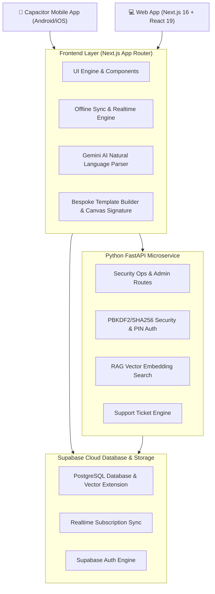

<div align="center">
  
  <h1>MakInvoices — Advanced AI-Powered Billing & Ledger Ecosystem</h1>
  <p><em>Enterprise-grade, AI-assisted invoicing, multi-region tax ledgers, and document automation platform.</em></p>

  [](https://nextjs.org/)
  [](https://react.dev/)
  [](https://www.typescriptlang.org/)
  [](https://fastapi.tiangolo.com/)
  [](https://supabase.com/)
  [](https://ai.google.dev/)
  [](https://capacitorjs.com/)
</div>

---

## 📌 Executive Summary

**MakInvoices** is a full-stack, cross-platform financial ledger and invoicing system designed for freelancers, retailers, service providers, and accounting teams. It combines **Gemini AI Natural Language Transaction Parsing**, **Interactive Layered Invoice Customization**, **Multi-Rate Tax Auto-Splits (VAT/GST/HST)**, **Sales & Purchase Ledgers**, and an **RAG-Trained Live AI Assistant**.

---

## 🏗 System Architecture & Monorepo Overview



---

## 📁 Repository Directory Structure

```
OrganisedMakInvoice/
├── frontend/                   # Next.js 16 Web Application
│   ├── src/
│   │   ├── app/                # App Router Routes & API Endpoints
│   │   │   ├── [[...slug]]/    # Catch-all main App entry point
│   │   │   ├── [admin_slug]/   # Obfuscated Hidden Admin Panel
│   │   │   └── api/            # Serverless API routes (Chat, Smart-Billing, Payments)
│   │   ├── components/         # React Components (Dashboard, Homepage, InvoiceModal, etc.)
│   │   ├── lib/                # Core utilities (Supabase, Presets, RAG, Subscriptions)
│   │   └── types.ts            # Global TypeScript interfaces & schemas
│   └── admin_config.json       # Admin Panel obfuscation configuration
├── backend/                    # Python FastAPI Microservice
│   ├── app/
│   │   ├── api/                # FastAPI Routers (admin, ai, pin, tickets)
│   │   ├── middleware/         # Auth & CORS Middlewares
│   │   ├── schemas/            # Pydantic Schemas
│   │   └── services/           # Business logic & Vector Search services
│   ├── main.py                 # FastAPI Application Entrypoint
│   └── requirements.txt        # Python Dependencies
├── makinvoices-app/            # Capacitor Mobile App (Android & iOS)
│   ├── android/                # Native Android Studio Project
│   └── capacitor.config.json   # Native Capacitor Configuration
└── supabase/
    └── migrations/             # Production PostgreSQL Database Migrations
```

---

## 🗄 Database Schemas & Data Model

### 1. Invoices Table (`invoices`)
Stores all financial documents including Tax Invoices, Proforma Invoices, Credit Notes, Debit Notes, Purchase Orders, and Quotes.

```sql
CREATE TABLE public.invoices (
    id UUID PRIMARY KEY DEFAULT gen_random_uuid(),
    userId UUID NOT NULL REFERENCES auth.users(id) ON DELETE CASCADE,
    invoiceType VARCHAR(50) DEFAULT 'invoice', -- 'invoice' | 'proforma' | 'debit_note' | 'credit_note' | 'estimate' | 'quote' | 'purchases' | 'purchase_order' | 'purchase_debit_note'
    invoiceNumber VARCHAR(100) NOT NULL,
    referenceNumber VARCHAR(100),
    poNumber VARCHAR(100),
    deliveryNote TEXT,
    date DATE NOT NULL,
    dueDate DATE NOT NULL,
    clientName VARCHAR(255) NOT NULL,
    clientEmail VARCHAR(255),
    clientPhone VARCHAR(50),
    clientAddress TEXT,
    clientCompanyName VARCHAR(255),
    clientGstin VARCHAR(50),
    clientPan VARCHAR(50),
    clientState VARCHAR(100),
    clientCountry VARCHAR(100),
    notes TEXT,
    invoiceTerms TEXT,
    subtotal NUMERIC(15, 2) NOT NULL DEFAULT 0.00,
    discountType VARCHAR(20) DEFAULT 'none', -- 'none' | 'percent' | 'flat'
    discountValue NUMERIC(15, 2) DEFAULT 0.00,
    discountTotal NUMERIC(15, 2) DEFAULT 0.00,
    freightCharges NUMERIC(15, 2) DEFAULT 0.00,
    taxTotal NUMERIC(15, 2) NOT NULL DEFAULT 0.00,
    grandTotal NUMERIC(15, 2) NOT NULL DEFAULT 0.00,
    status VARCHAR(50) DEFAULT 'pending', -- 'draft' | 'sent' | 'pending' | 'paid' | 'partially_paid' | 'cancelled' | 'approved' | 'rejected'
    paidDate DATE,
    paidAmount NUMERIC(15, 2) DEFAULT 0.00,
    currency VARCHAR(10) DEFAULT 'INR',
    taxMode VARCHAR(20) DEFAULT 'dynamic', -- 'dynamic' | 'custom'
    placeOfSupply VARCHAR(100),
    ewayBillNo VARCHAR(100),
    transport VARCHAR(100),
    vehicleNo VARCHAR(100),
    items JSONB NOT NULL DEFAULT '[]'::jsonb, -- Array of InvoiceItem objects
    recurringSettings JSONB, -- Interval, start/end dates
    embeddedTemplate JSONB, -- Snapshotted visual template configuration
    isDeleted BOOLEAN DEFAULT FALSE,
    deletedAt TIMESTAMPTZ,
    createdAt TIMESTAMPTZ DEFAULT NOW(),
    updatedAt TIMESTAMPTZ DEFAULT NOW()
);
```

### 2. Client Profiles Table (`client_profiles`)
```sql
CREATE TABLE public.client_profiles (
    id UUID PRIMARY KEY DEFAULT gen_random_uuid(),
    userId UUID NOT NULL REFERENCES auth.users(id) ON DELETE CASCADE,
    name VARCHAR(255) NOT NULL,
    companyName VARCHAR(255),
    email VARCHAR(255),
    phone VARCHAR(50),
    address TEXT,
    createdAt TIMESTAMPTZ DEFAULT NOW(),
    updatedAt TIMESTAMPTZ DEFAULT NOW()
);
```

### 3. Expenses Table (`expenses`)
```sql
CREATE TABLE public.expenses (
    id UUID PRIMARY KEY DEFAULT gen_random_uuid(),
    user_id UUID NOT NULL REFERENCES auth.users(id) ON DELETE CASCADE,
    expense_date DATE NOT NULL,
    category VARCHAR(100) NOT NULL,
    vendor VARCHAR(255) NOT NULL,
    description TEXT,
    amount NUMERIC(15, 2) NOT NULL,
    payment_mode VARCHAR(50) DEFAULT 'cash',
    reference_number VARCHAR(100),
    status VARCHAR(50) DEFAULT 'paid',
    created_at TIMESTAMPTZ DEFAULT NOW(),
    updated_at TIMESTAMPTZ DEFAULT NOW()
);
```

### 4. Subscriptions Table (`subscriptions`)
```sql
CREATE TABLE public.subscriptions (
    id UUID PRIMARY KEY DEFAULT gen_random_uuid(),
    user_id UUID UNIQUE NOT NULL REFERENCES auth.users(id) ON DELETE CASCADE,
    tier VARCHAR(50) NOT NULL DEFAULT 'free', -- 'free' | 'pro' | 'enterprise'
    status VARCHAR(50) NOT NULL DEFAULT 'active', -- 'active' | 'cancelled' | 'past_due'
    gateway VARCHAR(50) DEFAULT 'razorpay', -- 'razorpay' | 'paddle'
    subscription_id VARCHAR(255),
    current_period_start TIMESTAMPTZ,
    current_period_end TIMESTAMPTZ,
    created_at TIMESTAMPTZ DEFAULT NOW(),
    updated_at TIMESTAMPTZ DEFAULT NOW()
);
```

---

## ⚡ Key Application Features & Technical Modules

### 1. 🤖 AI Gemini Smart Billing Engine
- **Natural Language Parsing**: Accepts prompts like *"Billed Acme Corp $450 for logo design and 3 hours consulting at $80/hr, add 18% GST"*.
- **Automatic Quantity Sync**: Increments duplicate item quantities automatically instead of spawning duplicate rows.
- **Smart Item Lookup**: Cross-references pre-saved inventory items (`PresetItem`) for instant autocomplete.

### 2. 🎨 Bespoke Invoice Template Builder
- **Drag & Drop Sections**: Reorder Header, Company Info, Product Table, Tax Engine, Payment Terms, and Signatures.
- **Vector Signature Canvas**: On-screen drawing canvas allowing users to sign invoices with touch/mouse and save Base64 signatures.
- **A4 / Letter Print Modes**: Custom page margins, background colors, and print styling controls.

### 3. 📊 Sales & Purchase Ledgers
- Multi-column sorting, date filtering, PDF export, and CSV downloads.
- Region-aware currency and number formatting engines.
- Cumulative partial payment tracking and auto-calculated balance due logic.

### 4. 🎓 Interactive App Tutorial Overlay
- Non-intrusive interactive walkthrough introducing each feature.
- Highlighted accent card overlay with responsive positioning.

---

## 🔒 Security Operations Admin Panel

A hidden Admin Panel provides system monitoring, audit logs, and user management.

### Access & Obfuscation
- The panel lives in `frontend/src/app/[admin_slug]`.
- The slug is configured in `frontend/admin_config.json` (e.g. `/internal-ops-9f3k`). Any invalid slug throws a `404 Not Found`.
- Blocked from search crawlers via `robots.ts`.

### Admin Capabilities
- **User Auditing**: View accounts, invoice counts, and active tier limits.
- **Audit Logs**: Track operational events and security triggers.
- **Support Tickets**: Manage user support tickets.

---

## 📱 Mobile App (Capacitor Android & iOS)

The mobile application wraps the web interface in native Capacitor containers:

- **Location**: `makinvoices-app/`
- **Config**: `makinvoices-app/capacitor.config.json`
- **Plugins**: `@capacitor/browser`, `@capacitor/app`, `@capacitor/core`.

### Building Android APK
```bash
cd makinvoices-app
npm install
npx cap sync android
npx cap open android
```
*In Android Studio, select **Build > Build Bundle(s) / APK(s) > Build APK(s)**.*

---

## ⚙️ Environment Variables Reference

### Frontend Environment ([.env.local](file:///f:/Projects/MakInvoices/OrganisedMakInvoice/frontend/.env.local))
```env
NEXT_PUBLIC_SUPABASE_URL=https://your-supabase-project.supabase.co
NEXT_PUBLIC_SUPABASE_ANON_KEY=your-supabase-anon-key
GEMINI_API_KEY=your-google-gemini-api-key
NEXT_PUBLIC_RAZORPAY_KEY_ID=your-razorpay-key-id
```

### Backend Environment ([backend/.env](file:///f:/Projects/MakInvoices/OrganisedMakInvoice/backend/.env))
```env
SUPABASE_URL=https://your-supabase-project.supabase.co
SUPABASE_SERVICE_ROLE_KEY=your-supabase-service-role-key
ADMIN_EMAIL=admin@makinvoices.com
ADMIN_PASSWORD_HASH=$2b$12$... # Bcrypt hash
ADMIN_JWT_SECRET=your-secure-jwt-secret
```

---

## 🚀 Local Development Setup Guide

### 1. Clone Repository
```bash
git clone https://github.com/YashAsija/OrganisedMakInvoice.git
cd OrganisedMakInvoice
```

### 2. Frontend Setup
```bash
cd frontend
npm install
npm run dev
```
*App will run locally at [http://localhost:3000](http://localhost:3000).*

### 3. Backend Setup (FastAPI)
```bash
cd backend
python -m venv .venv
# Windows:
.venv\Scripts\activate
# Linux/macOS:
source .venv/bin/activate

pip install -r requirements.txt
python main.py
```
*FastAPI server will run locally at [http://localhost:8000](http://localhost:8000).*

---

## 📄 License & Attribution

Copyright © 2026 **MakInvoices**. All rights reserved.  
Designed and engineered for global financial management.
